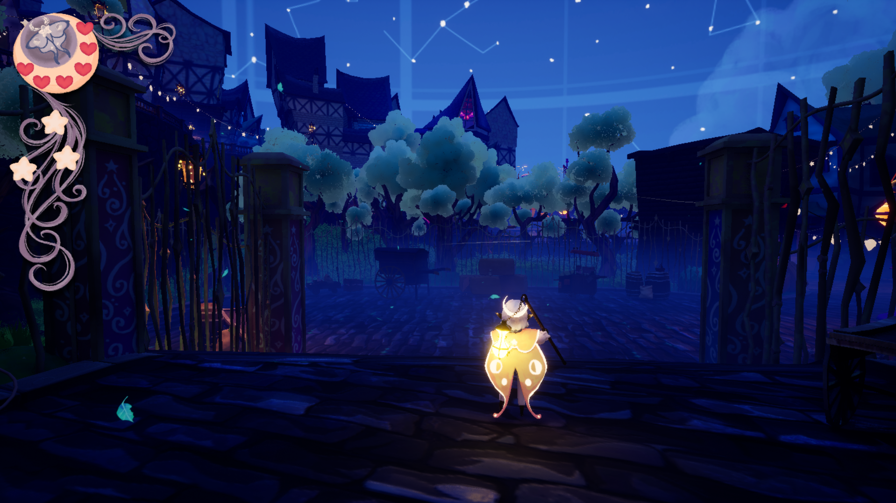
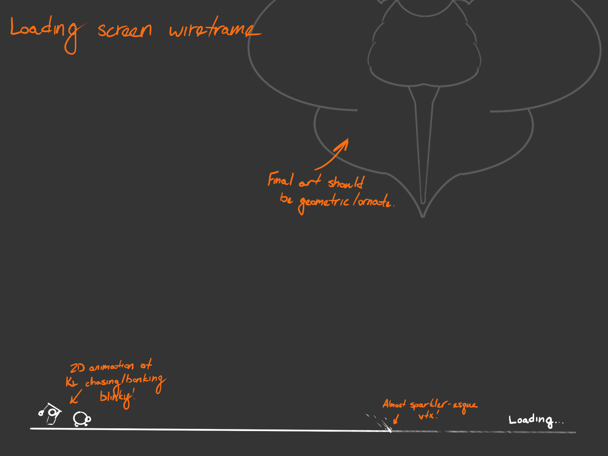
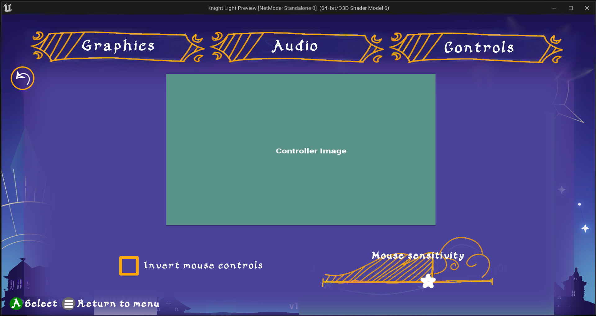

Deliverables:
* Concept, wireframe, and mock-up of in-game HUD.
* Concept, wireframe, and mock-up for game state screens, like game-over screens.

The interface strike team consisted of three people: me (designer), Tori (artist), and Jacob (artist). At the time, the game's UI needed immediate triage, so our goal was to rework as much of the offending UI as we would have time for. Ultimately, this resulted in not all of our designs being represented in the final project. Still, the unimplemented work I produced was quite good, and I'd like to showcase what I did.

> [!info]+ Retrospective
> If I went back, I'd be more involved with implementation. The engineering team was underwater and couldn't support the UI effort. Jacob volunteered to handle the implementation. Looking back, if I had also worked on implementation, we could've gotten more of our work in. This would've required re-balancing the design team's labor distribution (I would likely need to obstain from working on levels in order to have enough bandwidth).

# HUD
Health and mana needed to be represented on screen during combat. Additionally, the design team was working on an upgrades system that was ultimately scraped, so we had designed the HUD to be compatible with that system.
* Finding the right shape was actually a difficult exercise. The artists and I would send sketches back and forth, looking for a shape that balanced communicating a lot of information without being too overbearing.
* The painterly style of the UI was to tie into the childrens' bedtime story inspiration of the game. The lunar motifs were ultimately dropped, but the moth replacing it is inspired by Victorian-era bug pinboards.
* I really advocated to drop mana from the HUD entirely and represent it as an in-world wisp that orbited Ptolemy, but ultimately I couldn't secure the VFX budget for it.

# Game States
The biggest pain point in our UI was our utility screens, especially the loading, game over, and settings menus. They were very dense with information which the player was expected to remember.
* To solve this, I wanted to strip as much text out of those screens as possible; if the game is inspired by bedtime stories, then we'd want to evoke the feeling of being a sleepy kid.
* I also wanted more movement in the menus, even two-frame animations, to give the game life and keep the viewer's eye.

# Game Over

I pitched a version of the game-over state that ultimately did not make it to release. In this version, the game over revolves around three core elements. Rotating the camera reframes the player's perspective, establishing a loss of control. Changing the background reinforces the state change visually, literally removing the player from the level. Finally, the eyes and fog as a visual communicates what a loss state actually represents in the narrative.

> [!info]
> Unfortunately, we just didn't have the bandwidth to greenlight this feature. Instead, we repurposed the utilitarian game-over state seen in earlier prototypes of the project. We added a rudimentary version of the camera spin in the final release.

