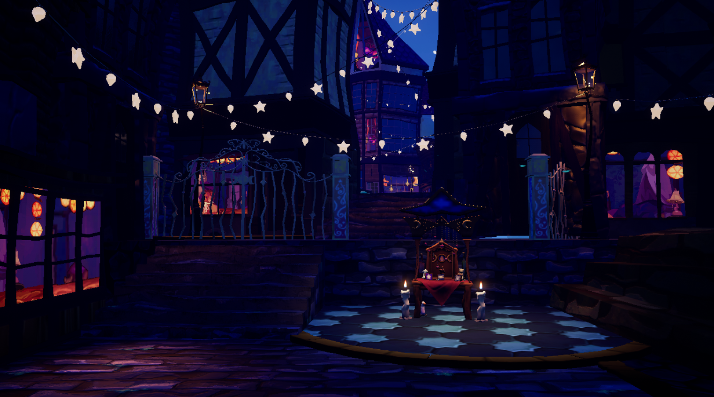
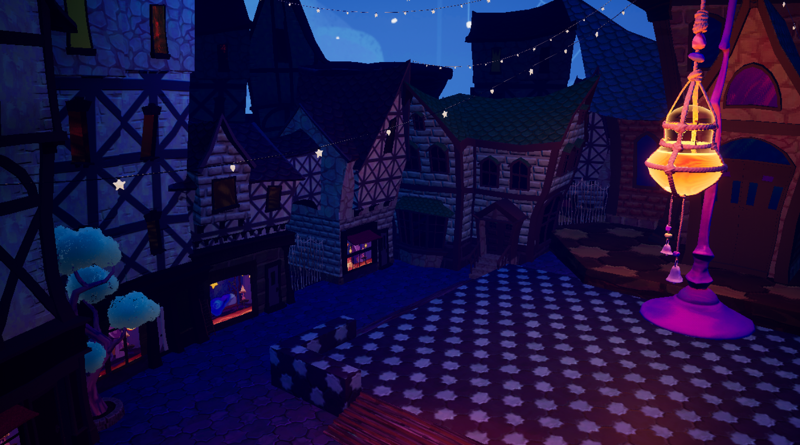
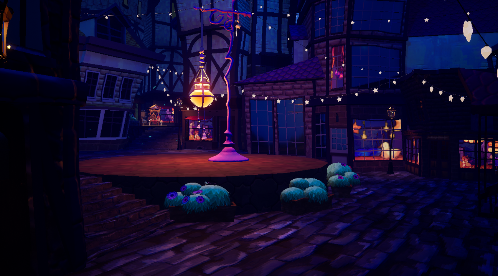
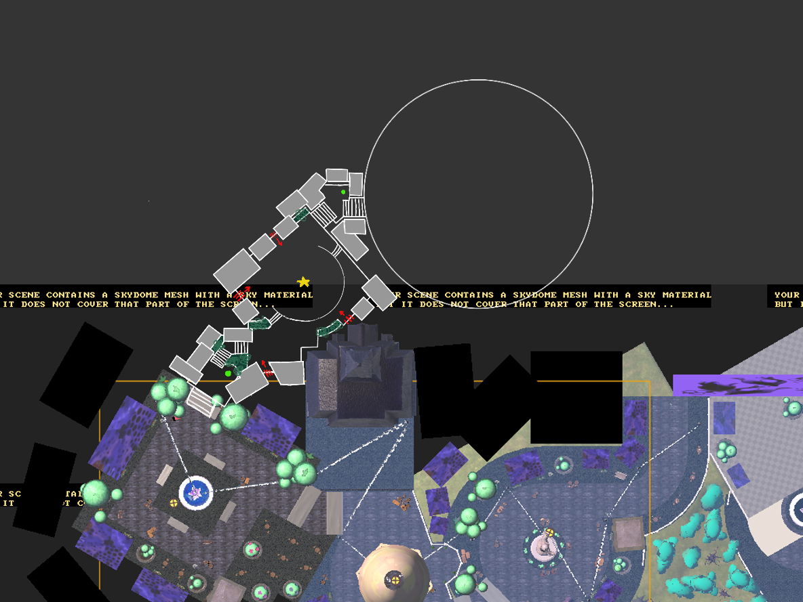
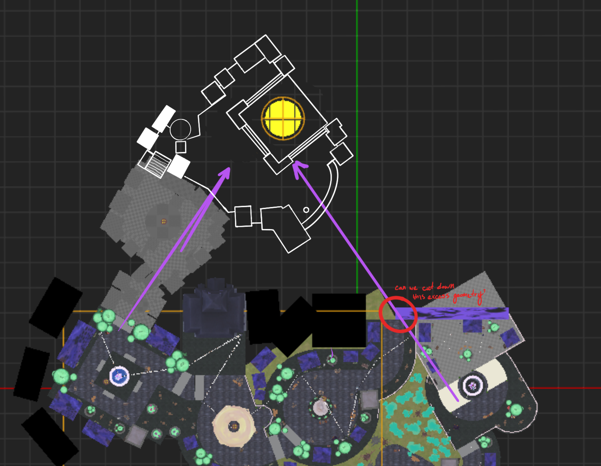
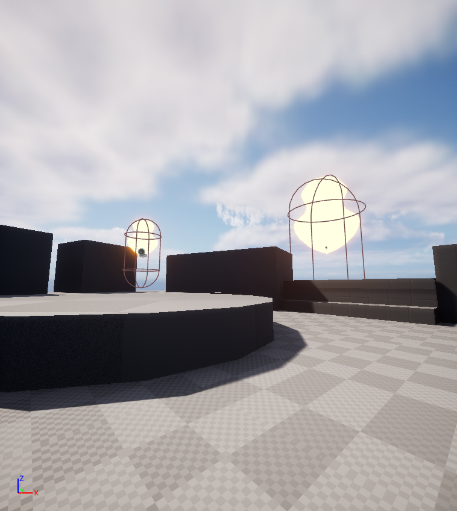
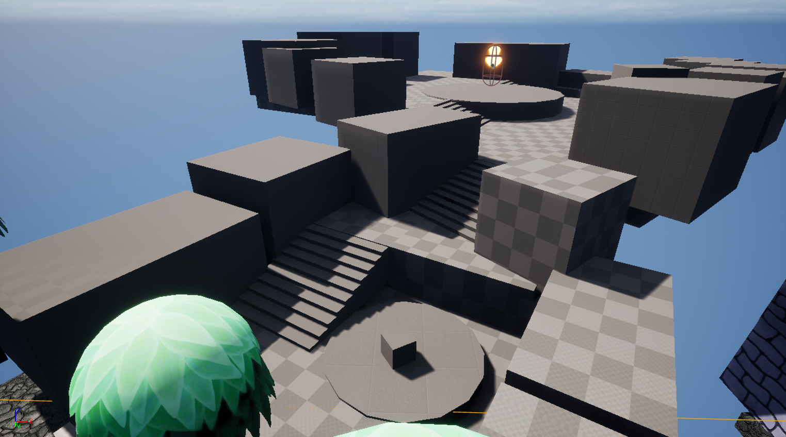
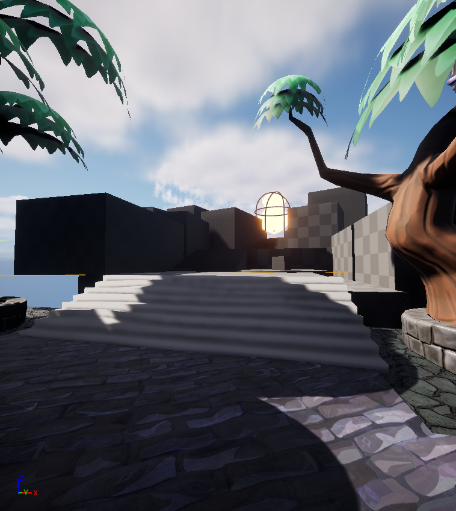

Deliverables:
* Third level, including paper map, whitebox, and dressing pass.
* Design world map and establish style guidelines for transitional spaces.

As part of our effort to distribute the design workload, I assumed responsibility over the third level. This would mean fully designing, mapping, and building the space.

# Level Three
For this level, I'd only have roughly one and a half weeks to fully realize the level. Given the tight deadline, I priortized two concepts:
  * *Creating sight lines*: Since this level is the climb to the final witch ball, I focused on preserving line of sight to it from multiple key locations in the level. This gives the player direction and anticipation.
  * *Narrow pathways*: Knight Light takes place in an urban environment, so keeping footpaths tight would help sell the setting. This was also a nice way to keep the player railroaded towards the final witch ball, preventing them from getting lost.

The space I designed for the final shrine also became the design standard for the other two shrine locations, as it exemplified the intimacy we wanted to evoke with the gifts and upgrades mechanics.

On this project, my workflow was to use Procreate -> Affinity v2 -> UE5 Modeling Suite -> in-house environment kit. Instead of completing the map before whiteboxing and so on, I worked piecemail. I budgeted the space in Procreate, then moved room by room. The blockout of one room would then inform the layout of the next, allowing me to use the space very densely without extra iterations. The downside: if a later room reveals a foundational issue with the whole level, you've already invested time into the current iteration.

