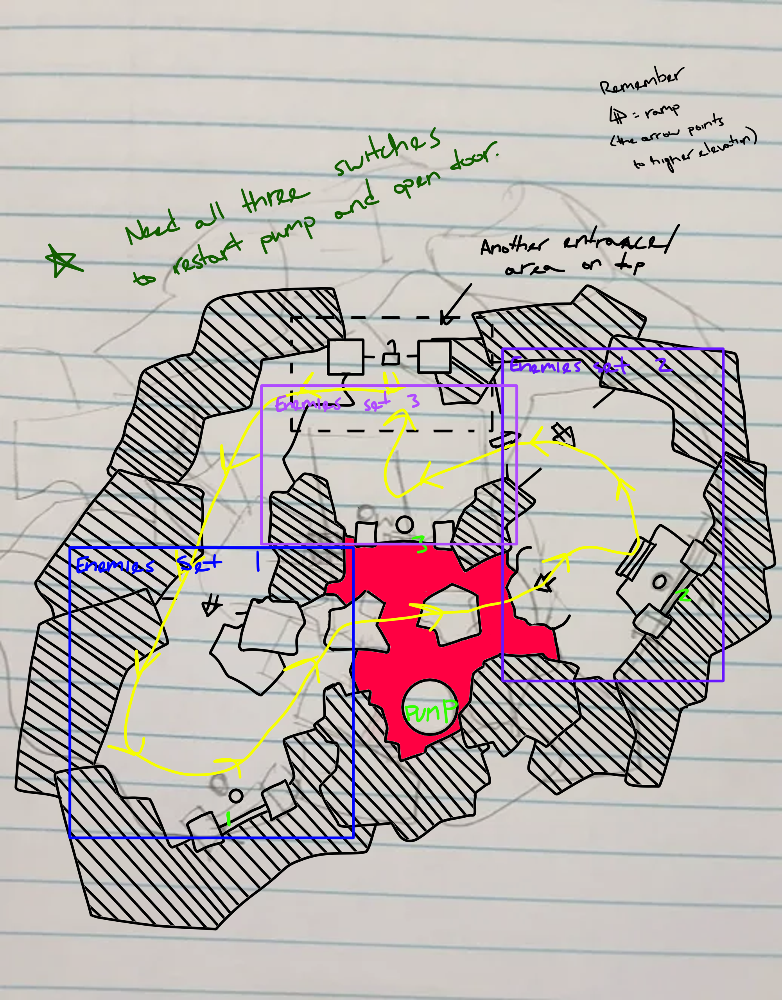
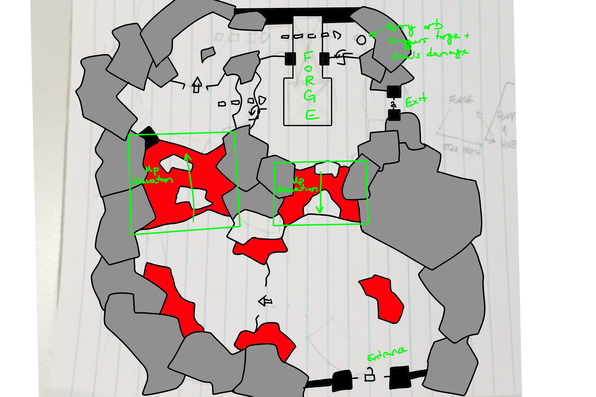

## Level Design
Deliverables:
* 3 brand new levels.
* Paper maps for each.
* Whiteboxes for each.
* Leading the environment strike team.
* New tutorial sequence.

### Pre-production
> [!abstract] Brief
> **Starting point:** Temporary level, no intentions to ship.  
> **Objective:** Three new levels, expand the environment kit, reinforce engagement through sweeping environments.



- *From a meeting with the CD*: individual biomes per level -- canyon, waterfall, pump, forge.
- *Hub space*: A central observatory structure to return to between levels.
- *Size*: Enemies kept getting smaller throughout production, so combat areas needed sized down.
- *From the systems designer*: Circular level design with lots of spiraling. Later scoped out of production but too late to make changes to the level.
- *To instill a sense of wonder* **(design pillar)**: large sweeping vistas and quiet downtime sections.



Following this, I got to work on drawing maps for each of the levels. Rough sketches of each map were created with paper and pencil, before being photographed and traced over in Krita for clarity and easy editing.





### Whitebox phase
I was responsible for nearly all of the in-engine whiteboxing of the levels, either independently or leading a strike time.
* WB models were done in the UE5 modeling suite.
* Each whitebox was built in a sub-level for easy loading/unloading and collaboration.
* To leave time for set dressers, lighting artists, AI programmers, QA, and the audio team, all levels needed to be completed in a **6 week timeframe** (quite tight!).
* We made the difficult decision to cut the third level at this phase, as we were already stretching team bandwidth.

> [!tip] Big changes
> While whiteboxing, some miscommunications occured that resulted in the levels being scaled too high! I spent a lot of time bringing everything back down to size, but ultimately the levels still have scale issues. Since then, I've been way more careful about how I document and communicate my levels and I always size conservatively.

> [!WARNING]
> Insert gallery!

To help artists visualize the space, I took screenshots of the level into Krita. I would sketch over key corridors, as well as mark details with numbers. These numbers correlated to a second document with annotations. I found this approach to be effective in communicating to visually-minded coworkers.

> [!WARNING]
> Insert gallery!

### Dressing phase
After level lock, I switched focus. I took on leading the environment strike team, comprised of artists and programmers who would dress the whiteboxes using the environment kit. I also participated in the ground operations for this step, although I also devoted my attention to my duties on the UI team.
* Having so many cooks in the kitchen posed serious concurrency issues! It became super important to communicate across departments about who was working on each level, and when they expected to commit it.

> [!WARNING]
> Insert gallery!

### Results
The levels shipped on-time with the first release candidate. My workflow had completely evolved during this process, and for that reason, I'm content with the project.

That said, I definitely have my critiques of how the levels turned out. The team had planned for an extended four months of production, but that project fell through. The roadmap I had planned addressed the following:
* adding a "quick return" to the hub between levels.
* massively reducing the walking time between levels.
* simple progression mechanisms unique to each level (unfreezing the waterfall, activating the star pump, etc.).
* overhauling platforming sections to better utilize the dash and slowfall abilities.
* mini-boss variants unique to each level and its theme.

> [!WARNING]
> Insert gallery!